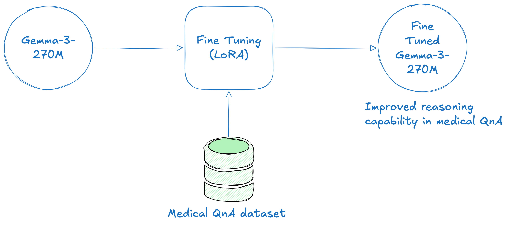

# Fine-Tuning Gemma 3 270M for Medical Reasoning

This project focuses on fine-tuning the [Gemma 3 270M](https://developers.googleblog.com/en/introducing-gemma-3-270m/) language model on a specialized medical dataset to enhance its reasoning and question-answering capabilities in the medical domain.

## Motivation

Large Language Models (LLMs) like Gemma 3 are powerful, but their general-purpose training can limit their effectiveness in specialized fields such as medicine. Also, since foundational models are general purpose they are quite huge in size and need high end computing for training and inference. To address these challenges, I tried fine-tuning Gemma 3 270M on a curated medical dataset, where I aim to improve its ability to understand, reason, and answer complex medical questions with greater accuracy and reliability. I opted for Gemma 3 270M because of its significantly small memory footprint that can be efficiently fine tuned and run locally on low end devices which solves the issue of privacy and local first, offline inference for medical applications where privacy is a non negotiable requirement.

## Objectives

- Enhance the reasoning capabilities of Gemma 3 270M for medical Q&A tasks
- Improve the model's performance on domain-specific queries
- Use the fine tuned model for offline, privacy-first inference on edge devices

## Dataset

The fine-tuning dataset consists of medical question-answer pairs with complex Chain of Thoughts, covering a wide range of topics such as diagnostics, treatments, pharmacology, and clinical reasoning. The dataset was sourced from Hugging Face dataset hub - [FreedomIntelligence/medical-o1-reasoning-SFT](https://huggingface.co/datasets/FreedomIntelligence/medical-o1-reasoning-SFT).

## Fine-Tuning Approach

1. **Model Selection:** Gemma 3 270M was chosen for its balance of performance, efficiency and significantly small parameters size.
2. **Data Preparation:** The medical dataset was tokenized, and formatted with right chat template for supervised fine-tuning.
3. **Training:** The model was fine-tuned using supervised learning utilizing PEFT technique of LoRA optimizing for accuracy and reasoning on medical questions.

## Results

After fine-tuning, the model demonstrated improved reasoning and accuracy on medical Q&A benchmarks compared to the base model. Detailed evaluation results and sample outputs are provided in the accompanying notebook.

## Usage

To reproduce the fine-tuning or use the enhanced model:

1. Clone this repository
2. Open the `fine_tuning_gemma3_medical.ipynb` notebook
3. Follow the steps for data preparation, training, and evaluation

## Requirements

- Python 3.11+
- PyTorch
- Hugging Face Transformers
- Jupyter Notebook
- (Other dependencies as specified in the notebook)

## License

This project is licensed under the terms of the LICENSE file in this repository.

---

For questions or contributions, please open an issue or submit a pull request.
